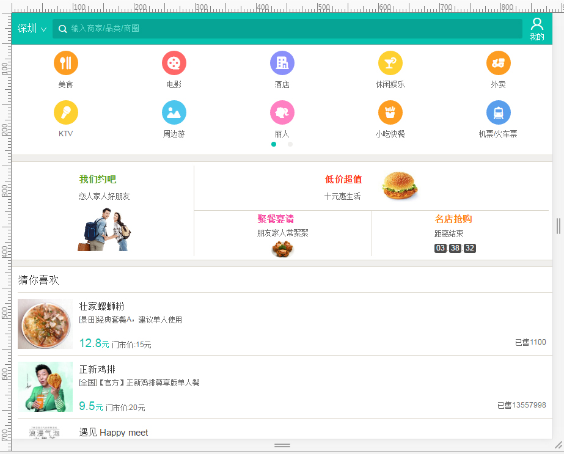

# 美团（手机网页版）
> 1.相关参数
* 物理设备:phone6 plus
* 视口：'<meta name="viewport"
                content="width=device-width, user-scalable=no,
                initial-scale=0.5, maximum-scale=0.5, minimum-scale=0.5">''
* 根目录字体大小：'html{font-size:100px;};body{font-size: font-size: 0.16rem;}'
* 避免使用：px、浮动布局
> 2.伸缩盒子布局
####如图：
 
* 1.两端固定宽度各自左右对齐，中间使用伸缩盒子布局，自适应拉伸。
* 2.如果有图片的话，给父元素固定宽度，图片自身宽度100%。
* 3.具体的伸缩布局要以参照的具体效果来对照。

> 3.遇到的问题
* 1.头部固定（使用固定布局来写）。
* 2.伸缩盒子布局不够熟练。
* 3.rem在移动端的具体应用及换算。
* 4.字体图标的引入及具体应用（图文混排效果）

> 4.解决问题
 * 1.复习相关知识点。
 * 2.头部固定布局（先固定再使用伸缩盒子布局）
 * 3.rem以根目录为参照，1rem=16px
 * 4.掌握字体图标的3中引入方式以及字体图标的应用